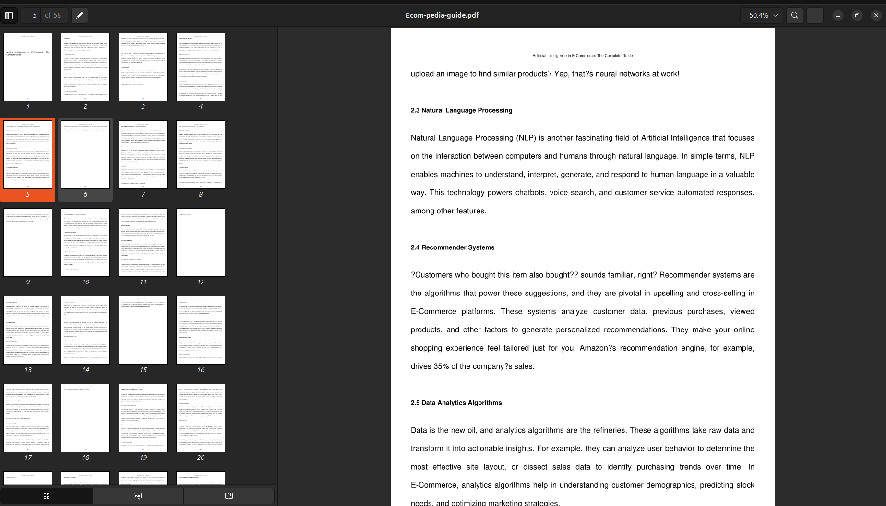

# Web Scraper and PDF Generator

This Python script scrapes content from a specific webpage about Artificial Intelligence in E-Commerce and generates a PDF document from the extracted information.

## The script will:
1. Fetch content from the URL: 'https://ecom-pedia.com/artificial-intelligence-in-e-commerce-the-guide/'
2. Parse the HTML content
3. Extract relevant information from the main content div
4. Generate a PDF file named 'text_content11.pdf' with the extracted content

## Output PDF file
# You can directly download from Ecom-pedia-guide.pdf in this repo

## Features

- Web scraping using `requests` and `selectolax`
- PDF generation using `fpdf`
- Custom PDF layout with title page, headers, footers, and formatted content

## Requirements

- Python 3.12.3
- Required libraries:
  - requests
  - selectolax
  - fpdf
